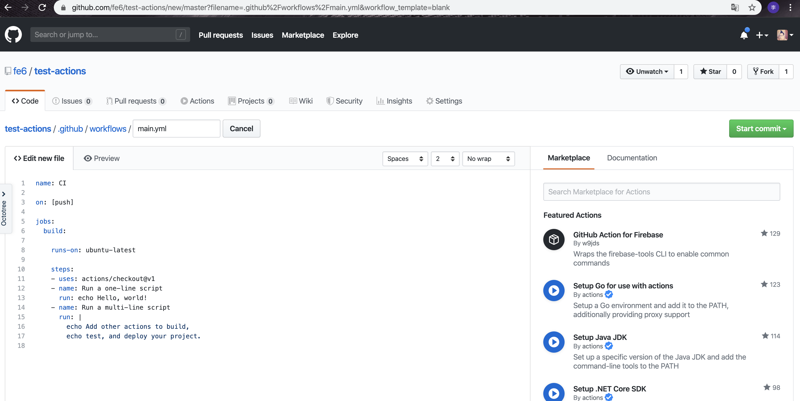
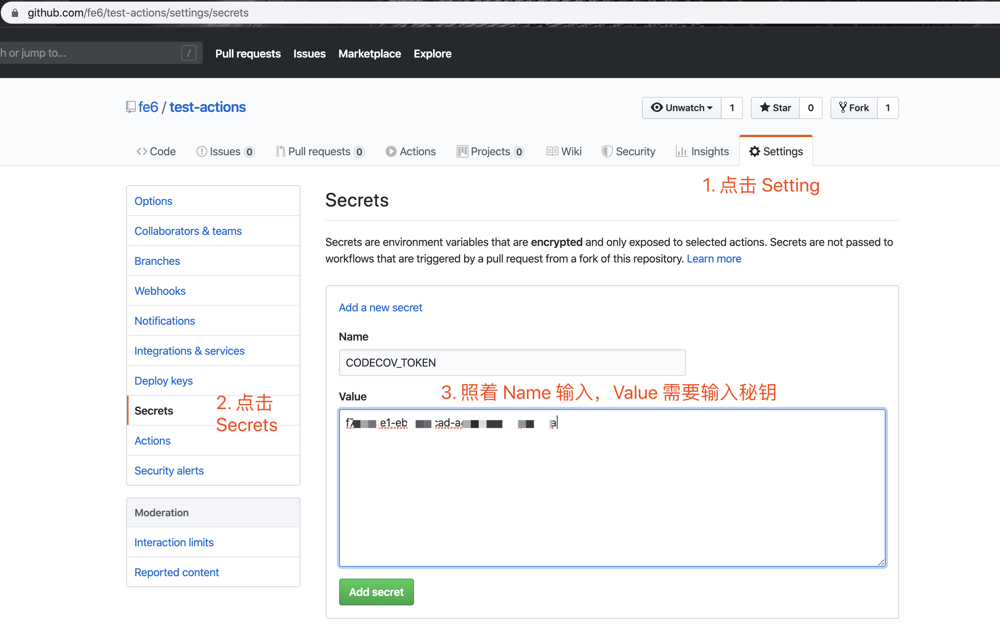

# 在 GitHub 配置 Actions

## 什么是 Actions

Actions 是前几年 GitHub 新推出的一个功能，就像是一种工作流。 Actions 可以进行代码审查，可以测试代码，还以干更多的事情，很多大厂的开源项目中都配置了 Actions 。

## 初始化一个项目

现在，我们有一个项目。这个项目很简单。有一个 Flat 方法的 JavaScript 文件，还有一个简单的 Sass 文件。在 Package.json 中配置了语法检测和单元测试的 Scripts 。今天我们就一起配置一个能够代码检查，单元测试，发送单元测试报告的 Actions 。

## 初始化 Actions

点击仓库导航中的 ***Actions*** 按钮，就会出现如下页面。上面是要保存的文件名字，我们把它修改成 `ci.yml` 。下面分两栏，左边就是我们要编写的 Actions 脚本的地方，右面是 Actions 市场，里面有很多不错的 Actions 。

[参考代码](https://github.com/fe6/test-actions/commit/d8d1bbc57ca9d70398997f4f042067be4db6b86a)

[Actions 运行结果](https://github.com/fe6/test-actions/commit/d8d1bbc57ca9d70398997f4f042067be4db6b86a/checks?check_suite_id=392173571)



## Actions 中的关键词

要写 Actions ，就要了解 Actions 中的关键词。

|关键词|描述|
|----|----|
|name|当前 Actions 的名字|
|on|触发 Actions 的操作，如 push (本地提交代码) ， pull_request (合并代码)|
|jobs|工作流的名字，下面会分很多的工作流|
|runs-on|运行系统|
|steps|操作步骤|

## 配置语法检测

我们把语法检测命名为 **lint** 。修改 **jobs** 中的代码。代码如下：

``` Bash
name: CI

on: [push]

jobs:
  lint:
    runs-on: ubuntu-latest # 添加 ubuntu-latest 的运行系统
    steps:
      - uses: actions/checkout@v1 # 获取到最新代码
      - uses: actions/setup-node@v1 # 设置 Node 版本
        with: # 用
          node-version: '12.x' # Node 12.x 版本
      - uses: borales/actions-yarn@v2.0.0 # 采用 yarn 安装依赖
        with:
          cmd: install # 将运行 `yarn install` 命令
      - name: Get yarn cache # 设置当前工作流名字
        id: yarn-cache # 缓存的 ID
        run: echo "::set-output name=dir::$(yarn cache dir)" # 运行命令

      - uses: actions/cache@v1
        with:
          path: ${{ steps.yarn-cache.outputs.dir }}
          key: ${{ runner.os }}-yarn-${{ hashFiles('**/yarn.lock') }}
          restore-keys: |
            ${{ runner.os }}-yarn-
      - uses: borales/actions-yarn@v2.0.0
        with:
          cmd: lint # 将运行 `yarn lint` 命令
```

[Actions 运行结果](https://github.com/fe6/test-actions/commit/da6bbeae046078e1550b98d118105d9ed982a8fc/checks?check_suite_id=392201612)

## 配置单元测试

在配置之前，我们现需要配置一下 **secrets.CODECOV_TOKEN** 。 **secrets.CODECOV_TOKEN** 是从 codecov 网站上获取的，需要加到项目中。具体步骤如下图所示：



我们把语法检测命名为 **test** 。修改 **jobs** 中的代码。代码如下：

``` Bash
jobs:
  test:
    runs-on: ubuntu-latest # 添加 ubuntu-latest 的运行系统
  steps:
    - uses: actions/checkout@v1 # 获取到最新代码
    - uses: actions/setup-node@v1 # 设置 Node 版本
      with: # 用
        node-version: '12.x' # Node 12.x 版本
    - uses: borales/actions-yarn@v2.0.0 # 采用 yarn 安装依赖
      with:
        cmd: install # 将运行 `yarn install` 命令
    - name: Get yarn cache # 设置当前工作流名字
      id: yarn-cache # 缓存的 ID
      run: echo "::set-output name=dir::$(yarn cache dir)" # 运行命令

    - uses: actions/cache@v1
      with:
        path: ${{ steps.yarn-cache.outputs.dir }}
        key: ${{ runner.os }}-yarn-${{ hashFiles('**/yarn.lock') }}
        restore-keys: |
          ${{ runner.os }}-yarn-
    - uses: borales/actions-yarn@v2.0.0
      with:
        cmd: test # 将运行 `yarn test` 命令
    - name: Upload coverage to Codecov # 设置当前工作流名字
      id: coverage-codecov
      uses: codecov/codecov-action@v1.0.5
      with:
        name: test-action # 上传报告的名字
        token: ${{ secrets.CODECOV_TOKEN }} # 秘钥
        file: ./coverage/clover.xml # 生成的单元测试
        flags:  unittests # 单元测试 标识
        yml: ./codecov.yml # codecov 的配置
        fail_ci_if_error: true # 上传单元报告失败是否整个 Actions 失败
```

[Actions 运行结果](https://github.com/fe6/test-actions/commit/9782191b3a33be667d144bc3cb599d076d18cd7b/checks?check_suite_id=392239135)

GitHub 美丽的 Actions 就为大家介绍到这里。今天，我们一起认识了 Actions ，并且又尝试的配置了一些 Actions。文中的一些讲解只是我目前的简单理解，欢迎大家狂喷哟。

完！感谢！
